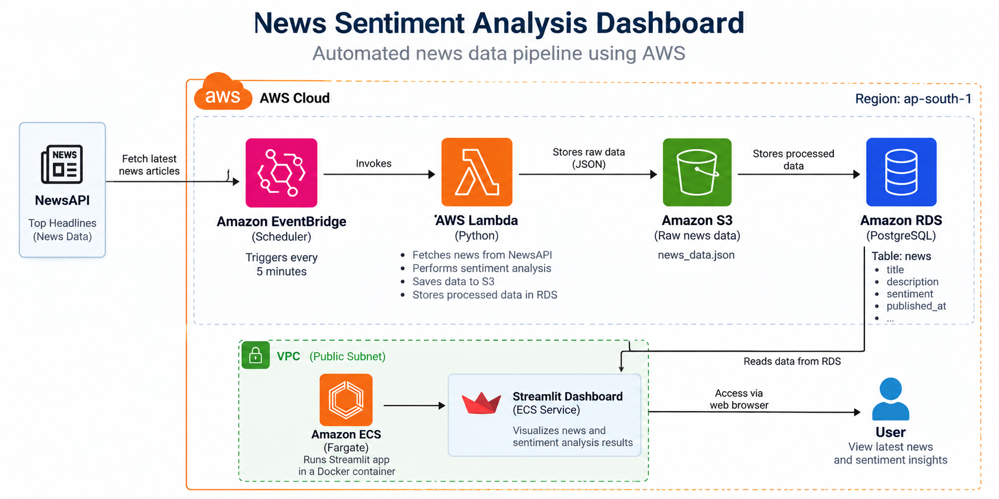
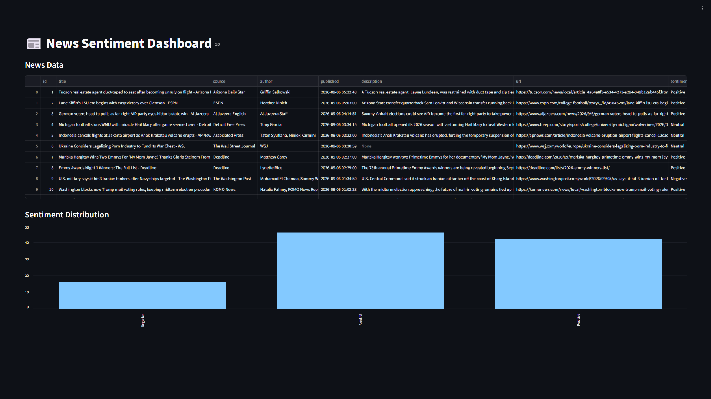
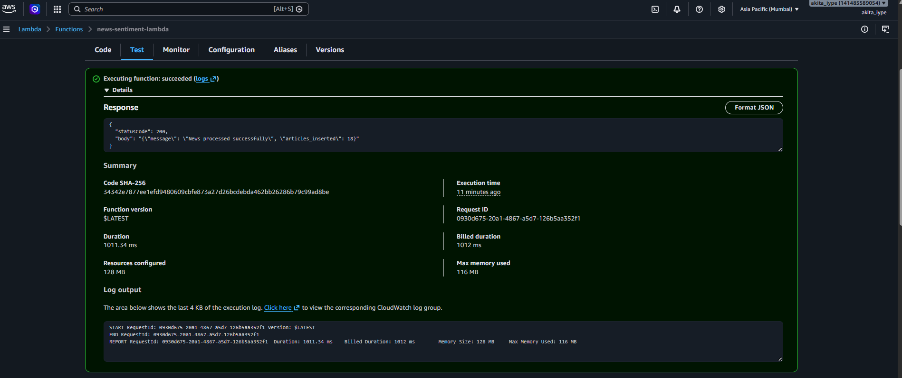
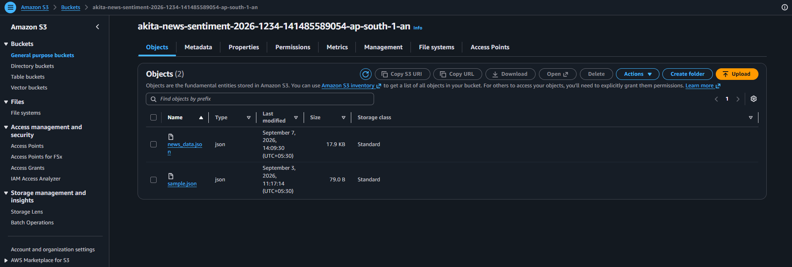
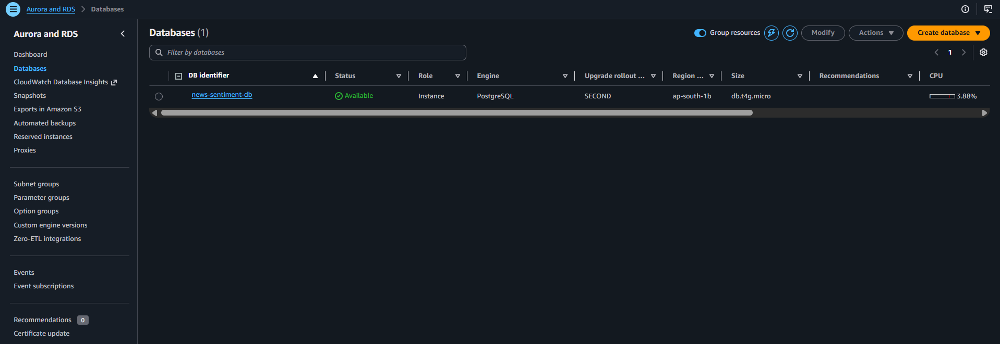
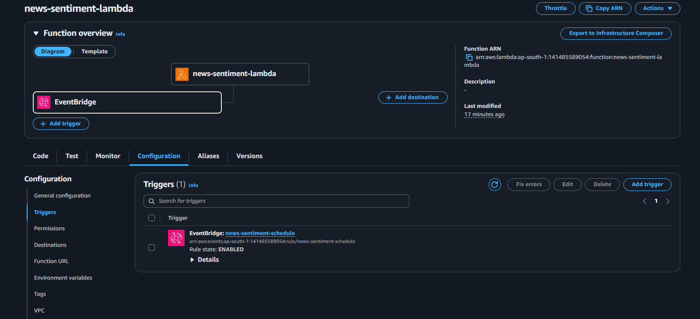
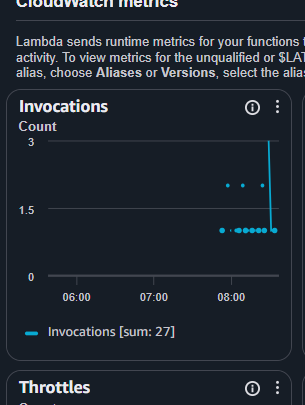
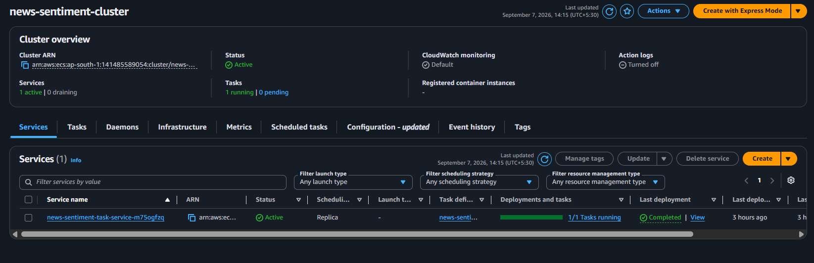

# 📰 News Sentiment Analysis using AWS

An end-to-end cloud-based News Sentiment Analysis system that automatically fetches the latest news articles, performs sentiment analysis, stores the results in PostgreSQL, saves raw JSON data to Amazon S3, and visualizes insights using a Streamlit dashboard.

---

## 📌 Project Overview

This project automates the process of collecting news headlines from the NewsAPI, analyzing their sentiment using TextBlob, and storing both the raw and processed data in AWS services. A Streamlit dashboard provides an interactive interface for viewing sentiment trends.

---

## 🏗️ Architecture



---

## 🚀 Features

- Fetches latest news using NewsAPI
- Performs sentiment analysis using TextBlob
- Classifies news as Positive, Negative, or Neutral
- Stores raw JSON data in Amazon S3
- Stores processed data in PostgreSQL (Amazon RDS)
- Executes automatically using AWS Lambda
- Scheduled every 5 minutes using Amazon EventBridge
- Interactive Streamlit dashboard
- Dockerized deployment using Amazon ECR and ECS Fargate

---

## 🛠️ Tech Stack

### Programming

- Python

### Libraries

- Requests
- TextBlob
- Pandas
- Matplotlib
- Streamlit
- Boto3
- Psycopg2

### AWS Services

- AWS Lambda
- Amazon S3
- Amazon RDS (PostgreSQL)
- Amazon EventBridge
- Amazon ECR
- Amazon ECS Fargate
- IAM
- CloudWatch

---

## 📂 Project Structure

```
news-sentiment-analysis/
│
├── dashboard/
│   ├── app.py
│   └── requirements.txt
│
├── lambda/
│   ├── lambda_function.py
│   ├── Dockerfile
│   └── requirements.txt
│
├── script/
│   ├── create_table.py
│   ├── insert_data.py
│   ├── view_data.py
│   ├── upload_to_s3.py
│   ├── db_test.py
│   ├── dashboard.py
│   └── requirements.txt
│
├── screenshots/
│
├── README.md
└── .gitignore
```

---

## 🔄 Workflow

1. EventBridge triggers AWS Lambda every 5 minutes.
2. Lambda fetches the latest news articles from NewsAPI.
3. TextBlob performs sentiment analysis on each news headline.
4. Raw news JSON is uploaded to Amazon S3.
5. Processed news is inserted into PostgreSQL (Amazon RDS).
6. Streamlit retrieves data from PostgreSQL.
7. Users view sentiment statistics through the dashboard.

---

## 📊 Dashboard

The dashboard displays:

- Latest news articles
- Sentiment classification
- Sentiment distribution
- Interactive charts

---

## 📷 Project Screenshots

### Dashboard



### AWS Lambda



### Amazon S3



### PostgreSQL Database



### EventBridge Scheduler



### CloudWatch Logs



### ECS Fargate



---

## 📈 Future Improvements

- Support multiple news categories
- Real-time sentiment dashboard
- Email notifications
- Historical trend analysis
- Machine Learning based sentiment analysis
- User authentication

---

## 👩‍💻 Author

**Akita**

GitHub: https://github.com/akitaiype2000-ship-it

---

## ⭐ If you found this project useful, consider giving it a star!
